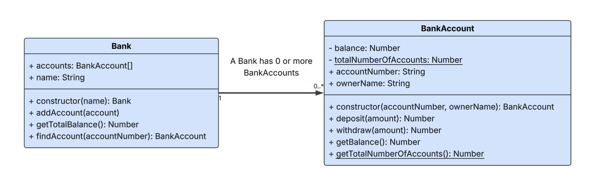

# Object-Oriented Programming Assessment

**Table of Contents:**
- [Assessment Overview](#assessment-overview)
  - [Setup Instructions](#setup-instructions)
  - [Running The Linter for Code Style](#running-the-linter-for-code-style)
  - [Submission Instructions](#submission-instructions)
  - [What Resources Can I Use?](#what-resources-can-i-use)
  - [FAQ](#faq)
  - [Good Luck! 🚀](#good-luck-)
- [Section 1: Short Response](#section-1-short-response)
  - [Question 1: Encapsulation](#question-1-encapsulation)
  - [Question 2: this Keyword](#question-2-this-keyword)
  - [Question 3: Polymorphism](#question-3-polymorphism)
  - [Question 4: Inheritance](#question-4-inheritance)
- [Section 2: Class Implementation](#section-2-class-implementation)
  - [Problem 1: Debug Broken Code - Bank and BankAccount](#problem-1-debug-broken-code---bank-and-bankaccount)
  - [Problem 2: Implement from Scratch - Pokemon](#problem-2-implement-from-scratch---pokemon)
  - [Problem 3: Implement from Scratch - Phone and iPhone](#problem-3-implement-from-scratch---phone-and-iphone)
    - [Part 1: **Phone class (parent):**](#part-1-phone-class-parent)
    - [Part 2: **iPhone class (child):**](#part-2-iphone-class-child)
- [Section 3: System Design](#section-3-system-design)
  - [Part 1: Design Your System](#part-1-design-your-system)
  - [Part 2: Create a UML Diagram](#part-2-create-a-uml-diagram)
  - [Step 3: Record Your Explanation](#step-3-record-your-explanation)

Welcome to your Object-Oriented Programming assessment! This assessment tests your understanding of classes, encapsulation, inheritance, polymorphism, and system design.

## Assessment Overview

The assessment has 3 sections:

1. **Short Response** - Answer questions about JavaScript concepts
2. **Class Implementation** - Implement JavaScript classes that satisfy the given requirements.
3. **System Design** - Design a system and create a UML diagram that reflects it

Your repository contains the following relevant files:

```
swe-assessment-2-oop/
├── README.md                          # This file - your instructions
├── rubric.md                          # The grading rubric for this assessment
└── src/
    ├── short-response.md             # Section 1: Answer questions here
    ├── phone.js                      # Section 2: Problem 3 - Implement Phone and iPhone
    ├── bank.js                       # Section 2: Problem 1 - Debug Bank and BankAccount
    ├── pokemon.js                    # Section 2: Problem 2 - Implement Pokemon
    └── system-design.md              # Section 3: Include a link to your design and your Loom recording
```

--- 

### Setup Instructions

Clone the Repository

```bash
git clone <repository-url>
cd swe-assessment-2-oop
```

Switch to a `draft` branch

```bash
git checkout -B draft
```

Install Dependencies

```bash
npm install
```

--- 

### Running The Linter for Code Style

Prior to submitting your work, run the "linter" which will inform you of any code style issues in your code.

**Check for linting errors:**
```bash
npm run lint
```

---

### Submission Instructions

Before submitting your assessment, go through this checklist to ensure you haven't missed any critical details!

**Submission Checklist:**
- [ ] All questions in `src/short-response.md` are answered
- [ ] All classes in `src/bank.js`, `src/pokemon.js`, and `src/phone.js` are implemented
- [ ] All links in `src/system-design.md` are provided
- [ ] Short responses have been proofread and cleared of any typos or grammar mistakes.
- [ ] Run `npm run lint` - fix any errors
- [ ] Remove any `console.log` statements used for debugging
- [ ] Remove any commented-out code

**How to Submit:**

1. Run the linter:

    ```bash
    npm run lint
    ```

    And fix any issues.

2. Commit your changes:
  
    ```bash
    git add -A
    git commit -m "Completed assessment"
    ```

3. Push to GitHub:
   
    ```bash
    git push
    ```

4. Create a pull request to merge `draft` into `main` and tag your instructor for review.

5. Submit on Canvas:

   - Double-check that your latest code is visible on the `draft` branch in GitHub
   - Submit the link to your pull request on Canvas

---

### What Resources Can I Use?

**Allowed Resources:**
- ✅ MDN Documentation
- ✅ Your notes from class
- ✅ Previous assignments and labs
- ✅ Running code in Node to test ideas

**NOT Allowed:**
- ❌ AI tools (ChatGPT, Claude, Copilot, etc.)
- ❌ Asking classmates for help
- ❌ Searching for solutions online
- ❌ Posting questions on Stack Overflow, Reddit, etc.

**If You're Stuck:**
- Read the error messages carefully
- Use `console.log()` to debug your code
- Take a break and come back with fresh eyes
- Remember: struggling is part of learning!

---

### FAQ

**Q: Can I use AI tools to check my code?**  
A: No, you may not. You are allowed to use official documentation (e.g. MDN), your notes, and our course GitBook for this exam. You may also use StackOverflow. However, you may not use LLMs, such as ChatGPT or Claude to support you on this exam.

**Q: Can I use AI tools to check my writing?**  
A: You may use Grammarly to proofread your writing to ensure that it is grammar-error and typo-free.

**Q: What if I don't finish in 6 hours?**
A: You can request a 1-day extension. Speak with an instructor.

**Q: Is there partial credit?**
A: Yes! Partial credit is awarded based on the rubric. Do your best!

**Q: Can I use Google?**
A: You can use MDN and official documentation, but don't search for solutions to the specific problems. Feel free to use the Marcy GitBook, your own notes, and past assignments.

**Q: What if my video is over the time?**
A: A few seconds over is fine. Just avoid excessive rambling.

**Q: Can I resubmit if I'm not happy with my score?**
A: Talk to your instructor about retake options.

--- 

### Good Luck! 🚀

Remember:
- Read all instructions carefully before starting
- Don't spend too much time on one question - move on and come back
- Save your work frequently (`git commit` regularly)
- Test your code as you write it

If you have questions about the instructions (not the content), ask an instructor.

## Section 1: Short Response

### Question 1: Encapsulation

In your own words, explain what does _encapsulation_ refer to? Why is this concept beneficial when programming? 

Provide a code snippet to illustrate _encapsulation_.

### Question 2: this Keyword

Explain what the `this` keyword is. Why is the `this` keyword useful?

In the code snippet below, what does `this` refer to?

```js
class Counter {
	constructor() {
		this.count = 0;
	}
  increment() {
    this.count++;
  }
}

const counterA = new Counter();
const counterB = new Counter();

counterA.increment();
counterA.increment();
counterA.increment();

counterB.increment();

console.log(counterA.count);
console.log(counterB.count);
```

### Question 3: Polymorphism

In your own words, explain what **polymorphism** means in OOP. Provide an example in code that demonstrates polymorphism.

### Question 4: Inheritance

You're building a game where players can raise different digital pets: Cats, Dogs, and Birds. All pets have have a `name`, `energy` level, and `happiness` level and can all `sleep`. Cats have the ability to `hunt`, dogs have the ability to `chase`, and birds have the ability to `fly`.

**Part A:** Describe in words how you would use inheritance to organize these classes.

**Part B:** Explain one advantage of using inheritance here instead of creating three completely separate classes.

## Section 2: Class Implementation

For these problems, there will *not* be any provided tests. You must implement your code to the best of your ability. We've provided example usage that you can use to manually test your code.

### Problem 1: Debug Broken Code - Bank and BankAccount

**Instructions:** The UML Diagram below was handed off to an AI Coding Agent to implement:



Remember the rules for UML Diagrams:
* `+` indicates a public property/method
* `-` indicates a private property/method
* Underline indicates a `static` property/method

As a result, the AI Coding Agent produced the file `src/bank.js`. It is your task to:
1. Analyze the code and verify that it works as expected.
2. Comment out any broken code.
3. Implement fixes.

Here is some sample test code with comments indicating expected output. You can use this directly in the `src/bank.js` file

```js
const myBank = new Bank("First National");
console.log(myBank); // Bank { name: "First National" }

const account1 = new BankAccount("001", "Alice");
const account2 = new BankAccount("002", "Bob");
console.log(account1); // BankAccount { accountNumber: "001", ownerName: "Alice" }
console.log(account2); // BankAccount { accountNumber: "002", ownerName: "Bob" }

myBank.addAccount(account1);
myBank.addAccount(account2);
console.log(myBank.accounts);
/* 
[
  BankAccount { accountNumber: "001", ownerName: "Alice" },
  BankAccount { accountNumber: "002", ownerName: "Bob" }
]
*/

account1.deposit(100); // Deposited $100. New Balance: 100
account1.withdraw(50); // Withdrew $50. New Balance: 50
account2.deposit(250); // Deposited $250. New Balance: 250
console.log(myBank.getTotalBalance()); // 300

console.log(myBank.findAccount("001").ownerName); // "Alice"

new BankAccount("003", "Charlie");
console.log("Total accounts:", BankAccount.getTotalAccounts()); // Should be 3
```

Run the file with

```sh
node src/bank.js
```

---

### Problem 2: Implement from Scratch - Pokemon

**Instructions:** In the `src/pokemon.js` file, create a Pokemon class with the following specifications:

- **Instance Properties:**
  - `name` (String, public, set by the constructor)
  - `type` (String, public, set by the constructor)
  - `health` (Number, *private*, starting value of `100`)
  - `level` (Number, *private*, starting value of `1`)
- **Instance Methods:**
  - "Getter" methods for the `health` and `level` private fields. Bonus points if you use the `get` syntax! ([get MDN documentation](https://developer.mozilla.org/en-US/docs/Web/JavaScript/Reference/Functions/get))
  - `levelUp()` - increases `level` by `1` and increases `health` by `10`. Then print `"{name} leveled up to level {level}!"`.
  - `isFainted()` - returns `true` if `health` is `0` or below, `false` otherwise.
  - `attack(targetPokemon)` - reduces the target Pokemon's `health` by an amount equal to `10` times the attacking Pokemon's `level`. Then print `"{name} attacked {target.name}!"`.
- **Static Properties**
  - `allPokemon` (array tracking all created Pokemon)
- **Static Methods**
  - `getTotalPokemon()` - returns count of all Pokemon created
  - `findByName(name)` - searches the `allPokemon` array and returns matching Pokemon

Test your code with following example usage:

```js
const charizard = new Pokemon("Charizard", "Fire");
const squirtle = new Pokemon("Squirtle", "Water");

// 1. Checking instance properties
console.log(charizard); // Pokemon { name: "Charizard", type: "Fire" }
console.log(squirtle); // Pokemon { name: "Squirtle", type: "Water" }

// 2. Leveling up a Pokemon
squirtle.levelUp(); // Squirtle leveled up to level 2!
squirtle.levelUp(); // Squirtle leveled up to level 3!
squirtle.levelUp(); // Squirtle leveled up to level 4!

// 3. Checking the level
console.log(squirtle.getLevel()); // 4
// OR if you use the get syntax
console.log(squirtle.level); // 4


// 4. Checking on health
console.log(squirtle.getHealth());   // Should be 130 (100 + 10*3 from leveling up)
// OR if you use the get syntax
console.log(squirtle.health);   // Should be 130 (100 + 10*3 from leveling up)


// 5. Attacking until one faints
while (!charizard.isFainted()) {
  squirtle.attack(charizard);  
}
console.log("Charizard has fainted!");


// 6. Finding a Pokemon instance
console.log(Pokemon.findByName("Charizard")); // Pokemon { name: "Charizard", type: "Fire" }


// 7. Viewing count of all Pokemon
console.log("Total Pokemon:", Pokemon.getTotalPokemon()); // 2
```

---

### Problem 3: Implement from Scratch - Phone and iPhone

**Instructions:** In the `src/phone.js` file, demonstrate inheritance by creating a `Phone` and `iPhone` class.

#### Part 1: **Phone class (parent):**

Create a `Phone` class with the following:

- Instance Properties:
  - `brand` (String, public, set by the constructor)
  - `model` (String, public, set by the constructor)
  - `password` (String, private, set by the constructor)
  - `batteryLevel` (Number, public, starting value of `100`) 
- Instance Methods:
  - `makeCall(number)` - decreases battery by `5`, returns `"Calling {number}"`
  - `charge()` - sets battery back to `100`, returns `"Phone fully charged"`
  - `unlock(password)` - returns `true` if the provided password matches the private password. Otherwise returns `false`.

Test your code with following example usage:

```js
const flipPhone = new Phone("Nokia", "Flip", "TimeToLearn882");
console.log(flipPhone); // Phone { brand: "Nokia", model: "Flip", batteryLevel: 100 }

// 1. Making a call and checking battery
console.log(flipPhone.makeCall("123-456-7890")); // Calling 123-456-7890
console.log(flipPhone.batteryLevel); // 95

// 2. Charging and checking battery
console.log(flipPhone.charge()); // Phone fully charged
console.log(flipPhone.batteryLevel); // 100

// 3. Unlocking the phone
console.log(flipPhone.unlock("TimeToLearn882")); // true
console.log(flipPhone.unlock("wrongpassword")); // false
```

#### Part 2: **iPhone class (child):**

Create a `iPhone` class with the following:

- Is a subclass of the `Phone` class
- The `brand` should always be set to `"Apple"`
- One additional property: `numberOfCameras` (Number, public, set by the constructor)
- Override `makeCall(number)` to return `"Calling {number} using FaceTime audio"`
- New method: `faceTime(name)` - decreases `batteryLevel` by 10, returns `"Facetiming {name}"`

Test your code with following example usage:

```js
const smartPhone = new iPhone("iPhone 14 Pro", "TimeToLearn882", 3);

console.log(smartPhone); // iPhone { brand: "Apple", model: "iPhone 14 Pro", numberOfCameras: 3, batteryLevel: 100}

// 1. Making a call 
console.log(smartPhone.makeCall("555-1234")); // Calling 555-1234 using FaceTime audio
console.log(smartPhone.batteryLevel); // Should be 95

// 2. Using the faceTime method
console.log(smartPhone.faceTime("Alice")); // Facetiming Alice
console.log(smartPhone.batteryLevel); // Should be 85

// 3. Charge the phone
console.log(smartPhone.charge()); // Phone fully charged
console.log(smartPhone.batteryLevel); // Should be 100

// 4. Unlock the phone
console.log(smartPhone.unlock("0000")); // false
console.log(smartPhone.unlock("TimeToLearn882")); // true
```

## Section 3: System Design

This section is meant to simulate an interview (and your upcoming assessment) so **aim to spend approximately 2 hours on it total**, and up to 3 hours if you must.
* 20-30 min: Understanding requirements and sketching initial design
* 30-40 min: Creating the UML diagram in LucidChart
* 20-30 min: Writing bullet points for explanation
* 15-20 min: Recording and reviewing the Loom

Your goal should be to hone your intuition around good system design and this time constraint will force you to make decisions.

### Part 1: Design Your System

**Scenario**: You are tasked with designing an **online restaurant ordering system**. Your system design should capture the essential *entities (classes)*, the *responsibilities* of those entities (properties/methods), and the *relationships* between them.

We recommend that you take notes as you create your system in the `system-design.md` file and **use pen and paper** to draw an initial sketch of your design.

**System Requirements**:
* Your system should be able to handle the following functionality:
  * A restaurant can manage the items in their menu
  * A customer can place an order with items from the restaurant's menu
  * An order can be marked as "pending", "in progress", "picked up", or "delivered"
* Your system must include at least three classes that are connected by relationships (associations), with at least one one-to-many relationship.

**Constraints**:
* Restaurants in this system are assumed to be pickup or delivery. No dining-in.

**Explanation Topics:** 
When you record your explanation, you will be asked to explain:
- How your system handles each of the system functionality requirements above: 
- Why you chose the specific relationships and class responsibilities.  
- At least one significant design decision you made and what alternatives or trade-offs you considered to arrive at your final design. 
  - Examples of significant decisions: where to store your data, how your system handles order status, which class is responsible for X, Y, or Z.

### Part 2: Create a UML Diagram

As you approach finalizing your design, transition to [LucidChart](https://www.lucidchart.com/) to create your UML diagram. 

When you are done, click **Share** in the top right corner, turn on the **Shareable link** and then paste the link in the `src/system-design.md` file.

**UML Requirements**: Your UML Diagram _must_ have the following:

1. Model relationships using arrows and appropriate multiplicity notation:
   * Exactly one: `1` (e.g. an adoption application has exactly 1 Pet)
   * Zero or more (many): `0..*` (e.g. a shelter has 0 or more pets)

2. Annotate relationships with **association labels** to describe each relationship
   *  Example: "Shelter --creates many--> Applications"
   *  Example: "Application --references one--> Adopter"

3. Include detailed class definitions with:
   * **Properties** (attributes) and their **data types** (e.g. `name: String`)
   * **Methods** (behaviors) and their **named parameters** (e.g. `findPetById(id)`)

### Step 3: Record Your Explanation

1. Use **Loom** to record your screen. For instructions on downloading Loom, refer to the [Marcy GitBook](https://marcylabschool.gitbook.io/marcy-lab-school-docs/environment-setup/loom).
   
2. In your video, you must explain the **Explanation Topics** listed in part 1.

3. Prior to recording, we highly recommend that you write out the key points of your explanation in bullets in the `src/system-design.md` file. 
  
4. Be specific and use proper technical vocabulary:
   | ✅ Good Example                                                          | 🚫 Bad Example                |
   |--------------------------------------------------------------------------|------------------------------|
   | "instance property" or "instance method"                                 | "variable" or "function"     |
   | "Pet status is updated by invoking setStatus()"                          | "A Pet changes status"       |
   | "A shelter houses many pets"                                             | "pets are in a shelter"      |
   | "A donor submits an application by invoking shelter.createApplication()" | "An application is created"  |

5. Keep your video concise (roughly between 5-7 minutes)

6. Upload your video and add the link to the comment at the top of `src/system-design.md`
